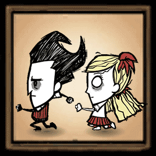

# mod-keep-following

## Overview

Mod for the game [Don't Starve Together][] which is available through the
[Steam Workshop][] and allows players to follow/push others or one of the
supported entities.

| Default Keys                                        | Actions                                        |
| --------------------------------------------------- | ---------------------------------------------- |
| <kbd>Shift</kbd> + <kbd>LMB</kbd>                   | to keep following                              |
| <kbd>Shift</kbd> + <kbd>Ctrl</kbd> + <kbd>LMB</kbd> | to keep pushing and ignore the target distance |

To stop following use <kbd>WASD</kbd> movement keys, <kbd>Space</kbd> (in-game
action key) or click <kbd>LMB</kbd>.

You can also use the above key combinations on a Tent/Siesta Lean-to used by
another player to keep following or pushing him.

## Configuration

Don't like the default behaviour? Choose your own configuration to match your
needs:

| Configuration               | Default       | Description                                                                  |
| --------------------------- | ------------- | ---------------------------------------------------------------------------- |
| **Action key**              | _Shift_       | Key used for both following and pushing                                      |
| **Push key**                | _Ctrl_        | Key used in combination with an action key for pushing                       |
| **Reverse buttons**         | _Disabled_    | When enabled, (LMB) and (RMB) will be swapped                                |
| **Compatibility**           | _Recommended_ | Which compatibility mode should be used?                                     |
| **Target indicator usage**  | _Binded_      | How should the target indicator interact with the action key?                |
| **Follow method**           | _Default_     | Which follow method should be used?                                          |
| **Follow distance**         | _2.5m_        | How close can a follower approach a leader?                                  |
| **Follow distance keeping** | _Disabled_    | When enabled, a follower moves away from a leader within the follow distance |
| **Push with RMB**           | _Disabled_    | When enabled, (RMB) + action key is used for pushing                         |
| **Push mass checking**      | _Enabled_     | When enabled, disables pushing entities with very high mass.                 |
| **Push lag compensation**   | _Enabled_     | When enabled, automatically disables the lag compensation during pushing     |
| **Debug**                   | _Disabled_    | When enabled, displays debug data in the console.                            |

## Documentation

The [LDoc][] documentation generator has been used for generating documentation,
and the most recent version can be found here:
https://docs.dstmodders.com/keep-following/

## License

Released under the [MIT License](https://opensource.org/licenses/MIT).

[don't starve together]: https://www.klei.com/games/dont-starve-together
[ldoc]: https://stevedonovan.github.io/ldoc/
[steam workshop]: https://steamcommunity.com/sharedfiles/filedetails/?id=1835465557
